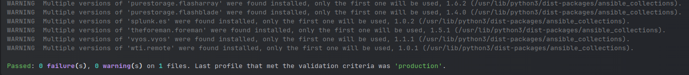

# Домашнее задание к занятию 2 «Работа с Playbook»

1. Inventory-файл [prod.yml](./playbook/inventory/prod.yml).
2. Допишите playbook: нужно сделать ещё один play, который устанавливает и настраивает [vector](https://vector.dev). Конфигурация vector должна деплоиться через template файл jinja2. От вас не требуется использовать все возможности шаблонизатора, просто вставьте стандартный конфиг в template файл. Информация по шаблонам по [ссылке](https://www.dmosk.ru/instruktions.php?object=ansible-nginx-install). не забудьте сделать handler на перезапуск vector в случае изменения конфигурации! \
    [playbook](./playbook/site.yml)
3. При создании tasks рекомендую использовать модули: `get_url`, `template`, `unarchive`, `file`.
4. Tasks должны: скачать дистрибутив нужной версии, выполнить распаковку в выбранную директорию, установить vector.
5. Запустите `ansible-lint site.yml` и исправьте ошибки, если они есть.

    

6. Попробуйте запустить playbook на этом окружении с флагом `--check`.

   ```
    /mnt/WorkSSD/git/devops-netology/ansible/08-ansible-02-playbook/playbook git:[main]
    ansible-playbook site.yml -i inventory/prod.yml --check
    
    PLAY [Install Clickhouse] *******************************************************************************************************************************************************************************************************
    
    TASK [Gathering Facts] **********************************************************************************************************************************************************************************************************
    [WARNING]: Platform linux on host clickhouse-01 is using the discovered Python interpreter at /usr/bin/python3.8, but future installation of another Python interpreter could change the meaning of that path. See
    https://docs.ansible.com/ansible-core/2.17/reference_appendices/interpreter_discovery.html for more information.
    ok: [clickhouse-01]
    
    TASK [Get clickhouse distribute] ************************************************************************************************************************************************************************************************
    ok: [clickhouse-01] => (item=clickhouse-client)
    ok: [clickhouse-01] => (item=clickhouse-server)
    ok: [clickhouse-01] => (item=clickhouse-common-static)
    
    TASK [Install clickhouse packages] **********************************************************************************************************************************************************************************************
    ok: [clickhouse-01] => (item=/home/artem/clickhouse-common-static_22.3.10.22_amd64.deb)
    ok: [clickhouse-01] => (item=/home/artem/clickhouse-client_22.3.10.22_amd64.deb)
    ok: [clickhouse-01] => (item=/home/artem/clickhouse-server_22.3.10.22_amd64.deb)
    
    TASK [Flush handlers] ***********************************************************************************************************************************************************************************************************
    
    TASK [Sleep for 60 seconds and continue with play] ******************************************************************************************************************************************************************************
    skipping: [clickhouse-01]
    
    TASK [Create database] **********************************************************************************************************************************************************************************************************
    skipping: [clickhouse-01]
    
    PLAY [Install Vector] ***********************************************************************************************************************************************************************************************************
    
    TASK [Gathering Facts] **********************************************************************************************************************************************************************************************************
    [WARNING]: Platform linux on host vector-01 is using the discovered Python interpreter at /usr/bin/python3.8, but future installation of another Python interpreter could change the meaning of that path. See
    https://docs.ansible.com/ansible-core/2.17/reference_appendices/interpreter_discovery.html for more information.
    ok: [vector-01]
    
    TASK [Download Vector distribute] ***********************************************************************************************************************************************************************************************
    ok: [vector-01]
    
    TASK [Install Vector distribute] ************************************************************************************************************************************************************************************************
    ok: [vector-01]
    
    TASK [Vector config] ************************************************************************************************************************************************************************************************************
    ok: [vector-01]
    
    TASK [Flush handlers] ***********************************************************************************************************************************************************************************************************
    
    PLAY RECAP **********************************************************************************************************************************************************************************************************************
    clickhouse-01              : ok=3    changed=0    unreachable=0    failed=0    skipped=2    rescued=0    ignored=0   
    vector-01                  : ok=4    changed=0    unreachable=0    failed=0    skipped=0    rescued=0    ignored=0      
   ```
7. Запустите playbook на `prod.yml` окружении с флагом `--diff`. Убедитесь, что изменения на системе произведены.
    ```
    /mnt/WorkSSD/git/devops-netology/ansible/08-ansible-02-playbook/playbook git:[main]
    ansible-playbook site.yml -i inventory/prod.yml --diff
    
    PLAY [Install Clickhouse] *******************************************************************************************************************************************************************************************************
    
    TASK [Gathering Facts] **********************************************************************************************************************************************************************************************************
    [WARNING]: Platform linux on host clickhouse-01 is using the discovered Python interpreter at /usr/bin/python3.8, but future installation of another Python interpreter could change the meaning of that path. See
    https://docs.ansible.com/ansible-core/2.17/reference_appendices/interpreter_discovery.html for more information.
    ok: [clickhouse-01]
    
    TASK [Get clickhouse distribute] ************************************************************************************************************************************************************************************************
    ok: [clickhouse-01] => (item=clickhouse-client)
    ok: [clickhouse-01] => (item=clickhouse-server)
    ok: [clickhouse-01] => (item=clickhouse-common-static)
    
    TASK [Install clickhouse packages] **********************************************************************************************************************************************************************************************
    ok: [clickhouse-01] => (item=/home/artem/clickhouse-common-static_22.3.10.22_amd64.deb)
    ok: [clickhouse-01] => (item=/home/artem/clickhouse-client_22.3.10.22_amd64.deb)
    ok: [clickhouse-01] => (item=/home/artem/clickhouse-server_22.3.10.22_amd64.deb)
    
    TASK [Flush handlers] ***********************************************************************************************************************************************************************************************************
    
    TASK [Sleep for 60 seconds and continue with play] ******************************************************************************************************************************************************************************
    ok: [clickhouse-01 -> localhost]
    
    TASK [Create database] **********************************************************************************************************************************************************************************************************
    ok: [clickhouse-01]
    
    PLAY [Install Vector] ***********************************************************************************************************************************************************************************************************
    
    TASK [Gathering Facts] **********************************************************************************************************************************************************************************************************
    [WARNING]: Platform linux on host vector-01 is using the discovered Python interpreter at /usr/bin/python3.8, but future installation of another Python interpreter could change the meaning of that path. See
    https://docs.ansible.com/ansible-core/2.17/reference_appendices/interpreter_discovery.html for more information.
    ok: [vector-01]
    
    TASK [Download Vector distribute] ***********************************************************************************************************************************************************************************************
    ok: [vector-01]
    
    TASK [Install Vector distribute] ************************************************************************************************************************************************************************************************
    ok: [vector-01]
    
    TASK [Vector config] ************************************************************************************************************************************************************************************************************
    ok: [vector-01]
    
    TASK [Flush handlers] ***********************************************************************************************************************************************************************************************************
    
    PLAY RECAP **********************************************************************************************************************************************************************************************************************
    clickhouse-01              : ok=5    changed=0    unreachable=0    failed=0    skipped=0    rescued=0    ignored=0   
    vector-01                  : ok=4    changed=0    unreachable=0    failed=0    skipped=0    rescued=0    ignored=0   
   ```
8. Повторно запустите playbook с флагом `--diff` и убедитесь, что playbook идемпотентен.
9. Подготовьте README.md-файл по своему playbook. В нём должно быть описано: что делает playbook, какие у него есть параметры и теги. Пример качественной документации ansible playbook по [ссылке](https://github.com/opensearch-project/ansible-playbook). Так же приложите скриншоты выполнения заданий №5-8
    
10. Готовый playbook выложите в свой репозиторий, поставьте тег `08-ansible-02-playbook` на фиксирующий коммит, в ответ предоставьте ссылку на него.

