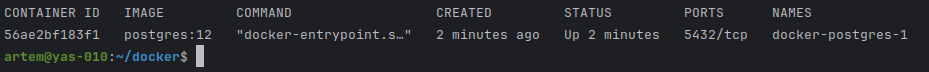

# Домашнее задание к занятию 2. «SQL»
## ВведениеПеред выполнением задания вы можете ознакомиться с [дополнительными материалами](https://github.com/netology-code/virt-homeworks/blob/virt-11/additional/README.md).
## Задача 1
Используя Docker, поднимите инстанс PostgreSQL (версию 12) c 2 volume, в который будут складываться данные БД и бэкапы.
Приведите получившуюся команду или docker-compose-манифест.  
Загрузил образ из репозитория [Docker](https://hub.docker.com/_/postgres) 
```shell
docker pull postgres:12
```
```yaml
services:
  postgres:
    image: postgres:12
    environment:
      POSTGRES_USER: "postgres"
      POSTGRES_PASSWORD: "postgres"
    volumes:
      - ./volumes/postgres/volume:/var/lib/postgresql/data
      - ./volumes/postgres/backups:/backups
```
```shell
docker ps
```
  
Порт не пробрасывал, потому что буду подключаться к контейнеру и работать в нем.    
```shell
docker exec -it docker-postgres-1 psql -U postgres
```
## Задача 2
В БД из задачи 1:   
- создайте пользователя test-admin-user и БД test_db;  
```text
postgres=# CREATE USER test-admin-user WITH PASSWORD 'pass';
ERROR:  syntax error at or near "-"
LINE 1: CREATE USER test-admin-user WITH PASSWORD 'pass';
                        ^
postgres=# CREATE USER test_admin_user WITH PASSWORD 'pass';
CREATE ROLE
postgres=# \du
                                      List of roles
    Role name    |                         Attributes                         | Member of 
-----------------+------------------------------------------------------------+-----------
 postgres        | Superuser, Create role, Create DB, Replication, Bypass RLS | {}
 test_admin_user |                                                            | {}
```
- в БД test_db создайте таблицу orders и clients (спeцификация таблиц ниже);  
```text
postgres=# CREATE DATABASE test_db;
CREATE DATABASE
postgres=# \l
                                 List of databases
   Name    |  Owner   | Encoding |  Collate   |   Ctype    |   Access privileges   
-----------+----------+----------+------------+------------+-----------------------
 postgres  | postgres | UTF8     | en_US.utf8 | en_US.utf8 | 
 template0 | postgres | UTF8     | en_US.utf8 | en_US.utf8 | =c/postgres          +
           |          |          |            |            | postgres=CTc/postgres
 template1 | postgres | UTF8     | en_US.utf8 | en_US.utf8 | =c/postgres          +
           |          |          |            |            | postgres=CTc/postgres
 test_db   | postgres | UTF8     | en_US.utf8 | en_US.utf8 | 
(4 rows)

```
- предоставьте привилегии на все операции пользователю test-admin-user на таблицы БД test_db;  
```text
postgres=# GRANT ALL PRIVILEGES ON DATABASE "test_db" to test_admin_user;
GRANT
postgres=# \c test_db
You are now connected to database "test_db" as user "postgres".
test_db=# GRANT ALL PRIVILEGES ON ALL TABLES IN SCHEMA public TO "test_admin_user";
GRANT
```
- создайте пользователя test-simple-user; 
```text
test_db=# CREATE USER test_simple_user;
CREATE ROLE
test_db=# \du
                                       List of roles
    Role name     |                         Attributes                         | Member of 
------------------+------------------------------------------------------------+-----------
 postgres         | Superuser, Create role, Create DB, Replication, Bypass RLS | {}
 test_admin_user  |                                                            | {}
 test_simple_user |                                                            | {}
```
- предоставьте пользователю test-simple-user права на SELECT/INSERT/UPDATE/DELETE этих таблиц БД test_db.  
```text
test_db=# GRANT SELECT, INSERT, UPDATE, DELETE ON ALL TABLES IN SCHEMA public TO "test_simple_user";
GRANT
```
Таблица orders:
- id (serial primary key);
- наименование (string);
- цена (integer).
```text
CREATE TABLE orders (
            id SERIAL PRIMARY KEY,
            name VARCHAR(100) NOT NULL,
            price INTEGER 
);
```
Таблица clients:
- id (serial primary key);
- фамилия (string);
- страна проживания (string, index);
- заказ (foreign key orders).
```text
CREATE TABLE clients (
            id SERIAL PRIMARY KEY,
            surname VARCHAR(50) NOT NULL,
            country VARCHAR(50) NOT NULL,
            order_id INTEGER REFERENCES orders (id) 
);
```
Приведите:
- итоговый список БД после выполнения пунктов выше;
```text
postgres=# \dt
          List of relations
 Schema |  Name   | Type  |  Owner   
--------+---------+-------+----------
 public | clients | table | postgres
 public | orders  | table | postgres
(2 rows)
```
- описание таблиц (describe);
```text
postgres=# \d orders
                                    Table "public.orders"
 Column |          Type          | Collation | Nullable |              Default               
--------+------------------------+-----------+----------+------------------------------------
 id     | integer                |           | not null | nextval('orders_id_seq'::regclass)
 name   | character varying(100) |           | not null | 
 price  | integer                |           |          | 
Indexes:
    "orders_pkey" PRIMARY KEY, btree (id)
Referenced by:
    TABLE "clients" CONSTRAINT "clients_order_id_fkey" FOREIGN KEY (order_id) REFERENCES orders(id)
```
```text
postgres=# \d clients
                                    Table "public.clients"
  Column  |         Type          | Collation | Nullable |               Default               
----------+-----------------------+-----------+----------+-------------------------------------
 id       | integer               |           | not null | nextval('clients_id_seq'::regclass)
 surname  | character varying(50) |           | not null | 
 country  | character varying(50) |           | not null | 
 order_id | integer               |           |          | 
Indexes:
    "clients_pkey" PRIMARY KEY, btree (id)
Foreign-key constraints:
    "clients_order_id_fkey" FOREIGN KEY (order_id) REFERENCES orders(id)
```
- SQL-запрос для выдачи списка пользователей с правами над таблицами test_db;
```text
postgres=# SELECT * FROM information_schema.role_table_grants WHERE grantee = 'test_admin_user';
 grantor  |     grantee     | table_catalog | table_schema | table_name | privilege_type | is_grantable | with_hierarchy 
----------+-----------------+---------------+--------------+------------+----------------+--------------+----------------
 postgres | test_admin_user | postgres      | public       | orders     | INSERT         | NO           | NO
 postgres | test_admin_user | postgres      | public       | orders     | SELECT         | NO           | YES
 postgres | test_admin_user | postgres      | public       | orders     | UPDATE         | NO           | NO
 postgres | test_admin_user | postgres      | public       | orders     | DELETE         | NO           | NO
 postgres | test_admin_user | postgres      | public       | orders     | TRUNCATE       | NO           | NO
 postgres | test_admin_user | postgres      | public       | orders     | REFERENCES     | NO           | NO
 postgres | test_admin_user | postgres      | public       | orders     | TRIGGER        | NO           | NO
 postgres | test_admin_user | postgres      | public       | clients    | INSERT         | NO           | NO
 postgres | test_admin_user | postgres      | public       | clients    | SELECT         | NO           | YES
 postgres | test_admin_user | postgres      | public       | clients    | UPDATE         | NO           | NO
 postgres | test_admin_user | postgres      | public       | clients    | DELETE         | NO           | NO
 postgres | test_admin_user | postgres      | public       | clients    | TRUNCATE       | NO           | NO
 postgres | test_admin_user | postgres      | public       | clients    | REFERENCES     | NO           | NO
 postgres | test_admin_user | postgres      | public       | clients    | TRIGGER        | NO           | NO
(14 rows)
```
```text
postgres=# SELECT * FROM information_schema.role_table_grants WHERE grantee = 'test_simple_user';
 grantor  |     grantee      | table_catalog | table_schema | table_name | privilege_type | is_grantable | with_hierarchy 
----------+------------------+---------------+--------------+------------+----------------+--------------+----------------
 postgres | test_simple_user | postgres      | public       | orders     | INSERT         | NO           | NO
 postgres | test_simple_user | postgres      | public       | orders     | SELECT         | NO           | YES
 postgres | test_simple_user | postgres      | public       | orders     | UPDATE         | NO           | NO
 postgres | test_simple_user | postgres      | public       | orders     | DELETE         | NO           | NO
 postgres | test_simple_user | postgres      | public       | clients    | INSERT         | NO           | NO
 postgres | test_simple_user | postgres      | public       | clients    | SELECT         | NO           | YES
 postgres | test_simple_user | postgres      | public       | clients    | UPDATE         | NO           | NO
 postgres | test_simple_user | postgres      | public       | clients    | DELETE         | NO           | NO
(8 rows)
```
- список пользователей с правами над таблицами test_db.
```text
postgres=# \dp
                                          Access privileges
 Schema |      Name      |   Type   |        Access privileges         | Column privileges | Policies 
--------+----------------+----------+----------------------------------+-------------------+----------
 public | clients        | table    | postgres=arwdDxt/postgres       +|                   | 
        |                |          | test_admin_user=arwdDxt/postgres+|                   | 
        |                |          | test_simple_user=arwd/postgres   |                   | 
 public | clients_id_seq | sequence |                                  |                   | 
 public | orders         | table    | postgres=arwdDxt/postgres       +|                   | 
        |                |          | test_admin_user=arwdDxt/postgres+|                   | 
        |                |          | test_simple_user=arwd/postgres   |                   | 
 public | orders_id_seq  | sequence |                                  |                   | 
(4 rows)
```
## Задача 3
Используя SQL-синтаксис, наполните таблицы следующими тестовыми данными:
Таблица orders

| Наименование | цена |
|--------------|------|
| Шоколад      | 10   |
| Принтер      | 3000 |
| Книга        | 500  |
| Монитор      | 7000 |
| Гитара       | 4000 |
```text
INSERT INTO orders (name, price)
VALUES  ('Шоколад',10),
        ('Принтер',3000),
        ('Книга',500),
        ('Монитор',7000),
        ('Гитара',4000);
```
Таблица clients

| ФИО                  | Страна проживания |
|----------------------|-------------------|
| Иванов Иван Иванович | USA               |
| Петров Петр Петрович | Canada            |
| Иоганн Себастьян Бах | Japan             |
| Ронни Джеймс Дио     | Russia            |
| Ritchie Blackmore    | Russia            |
```text
INSERT INTO clients (surname, country)
VALUES ('Иванов Иван Иванович','USA'),
       ('Петров Петр Петрович','Canada'),
       ('Иоганн Себастьян Бах','Japan'),
       ('Ронни Джеймс Дио','Russia'),
       ('Ritchie Blackmore','Russia');
```
Используя SQL-синтаксис:
- вычислите количество записей для каждой таблицы.
Приведите в ответе:    
- запросы,    
- результаты их выполнения.
```text
postgres=# SELECT count(*) 
  FROM orders; 
 count 
-------
     5
(1 row)
postgres=# SELECT count(*) 
  FROM clients; 
 count 
-------
     5
(1 row)
```  
## Задача 4
Часть пользователей из таблицы clients решили оформить заказы из таблицы orders.  
Используя foreign keys, свяжите записи из таблиц, согласно таблице:  

| ФИО                  | Заказ   |
|----------------------|---------|
| Иванов Иван Иванович | Книга   |
| Петров Петр Петрович | Монитор |
| Иоганн Себастьян Бах | Гитара  |

Приведите SQL-запросы для выполнения этих операций. 
```text
UPDATE clients 
   SET order_id = 3 
 WHERE surname = 'Иванов Иван Иванович';
UPDATE clients 
   SET order_id = 4 
 WHERE surname = 'Петров Петр Петрович'; 
UPDATE clients 
   SET order_id = 5 
 WHERE surname = 'Иоганн Себастьян Бах';
```
Приведите SQL-запрос для выдачи всех пользователей, которые совершили заказ, а также вывод этого запроса.  
```text
postgres=# SELECT * 
  FROM clients
 WHERE order_id IS NOT NULL;
 id |       surname        | country | order_id 
----+----------------------+---------+----------
  1 | Иванов Иван Иванович | USA     |        3
  2 | Петров Петр Петрович | Canada  |        4
  3 | Иоганн Себастьян Бах | Japan   |        5
(3 rows)
```
Подсказка: используйте директиву `UPDATE`.  
## Задача 5
Получите полную информацию по выполнению запроса выдачи всех пользователей из задачи 4 (используя директиву EXPLAIN).  
Приведите получившийся результат и объясните, что значат полученные значения. 
```text
postgres=# EXPLAIN SELECT * 
                     FROM clients
                    WHERE order_id IS NOT NULL;
                         QUERY PLAN                         
------------------------------------------------------------
 Seq Scan on clients  (cost=0.00..13.00 rows=298 width=244)
   Filter: (order_id IS NOT NULL)
(2 rows)
```
Взял данные из руководства [Postgrespro](https://postgrespro.ru/docs/postgresql/15/using-explain)  
##### Первая строка
Seq Scan - простое последовательное сканирование.  
on clients - таблица clients.  
cost=0.00 - приблизительная стоимость запуска. Это время, которое проходит, прежде чем начнётся этап вывода данных, 
например для сортирующего узла это время сортировки.  
..13.00 - приблизительная общая стоимость. Она вычисляется в предположении, что узел плана выполняется до конца, то 
есть возвращает все доступные строки. На практике родительский узел может досрочно прекратить чтение строк дочернего.  
rows - ожидаемое число строк, которое должен вывести этот узел плана. При этом так же предполагается, что узел 
выполняется до конца.  
width - ожидаемый средний размер строк, выводимых этим узлом плана (в байтах). 
##### Вторая строка
Filter - условие сканирования.
## Задача 6
Создайте бэкап БД test_db и поместите его в volume, предназначенный для бэкапов (см. задачу 1).  
Остановите контейнер с PostgreSQL, но не удаляйте volumes. Поднимите новый пустой контейнер с PostgreSQL.  
Восстановите БД test_db в новом контейнере.  
Приведите список операций, который вы применяли для бэкапа данных и восстановления.   

Создание бэкапа утилитой pg_dump  
```shell
pg_dump -U postgres test_db > /backups/db.sql
```
Остановка и удаление контейнера
```text
artem@yas-010:~/docker$ docker compose down 
[+] Running 2/2
 ✔ Container docker-postgres-1  Removed                                                                                                                                                                                 0.2s 
 ✔ Network docker_default       Removed                                                                                                                                                                                 0.3s 
artem@yas-010:~/docker$ 
```
С помощью нового файла compose.yaml создал новый контейнер.  
Подключился к новому контейнеру и проверил список БД перед восстановлением. БД отсутствует.
```text
artem@yas-010:~/docker2$ docker exec -it docker2-postgres2-1 psql -U postgres
psql (12.18 (Debian 12.18-1.pgdg120+2))
Type "help" for help.

postgres=# \l
                                 List of databases
   Name    |  Owner   | Encoding |  Collate   |   Ctype    |   Access privileges   
-----------+----------+----------+------------+------------+-----------------------
 postgres  | postgres | UTF8     | en_US.utf8 | en_US.utf8 | 
 template0 | postgres | UTF8     | en_US.utf8 | en_US.utf8 | =c/postgres          +
           |          |          |            |            | postgres=CTc/postgres
 template1 | postgres | UTF8     | en_US.utf8 | en_US.utf8 | =c/postgres          +
           |          |          |            |            | postgres=CTc/postgres
(3 rows)
```
Создал базу test_db на новом контейнере. `` CREATE DATABASE test_db; ``  
Переподключился к контейнеру.  
```shell
docker exec -it docker2-postgres2-1 sh
```
Восстановил БД
```shell
psql -U postgres  -d test_db -f /backups/db.sql
```
Подключился и проверил результат
```text
postgres=# \c test_db 
You are now connected to database "test_db" as user "postgres".
test_db=# select * from clients;
 id |       surname        | country | order_id 
----+----------------------+---------+----------
  4 | Ронни Джеймс Дио     | Russia  |         
  5 | Ritchie Blackmore    | Russia  |         
  2 | Петров Петр Петрович | Canada  |        4
  3 | Иоганн Себастьян Бах | Japan   |        5
  1 | Иванов Иван Иванович | USA     |        3
(5 rows)
```

---
### Как сдавать задание
Выполненное домашнее задание пришлите ссылкой на .md-файл в вашем репозитории.

---