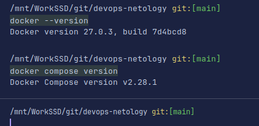

# Домашнее задание к занятию 4 «Оркестрация группой Docker контейнеров на примере Docker Compose»

### Инструкция к выполению

1. Для выполнения заданий обязательно ознакомьтесь с 
[инструкцией](https://github.com/netology-code/devops-materials/blob/master/cloudwork.MD) 
по экономии облачных ресурсов. Это нужно, чтобы не расходовать средства, 
полученные в результате использования промокода.
2. Практические задачи выполняйте на личной рабочей станции или созданной вами ранее ВМ в облаке.
3. Своё решение к задачам оформите в вашем GitHub репозитории в формате markdown!!!
4. В личном кабинете отправьте на проверку ссылку на .md-файл в вашем репозитории.

## Задача 1
<details>
 <summary>Текст задания 1</summary>
Сценарий выполнения задачи:
- Установите docker и docker compose plugin на свою linux рабочую станцию или ВМ.
- Если dockerhub недоступен создайте файл /etc/docker/daemon.json с содержимым: 
```
{
"registry-mirrors": ["https://mirror.gcr.io", 
"https://daocloud.io", 
"https://c.163.com/", 
"https://registry.docker-cn.com"]
}
```
- Зарегистрируйтесь и создайте публичный репозиторий  с именем "custom-nginx" на https://hub.docker.com (ТОЛЬКО ЕСЛИ У ВАС ЕСТЬ ДОСТУП);
- скачайте образ nginx:1.21.1;
- Создайте Dockerfile и реализуйте в нем замену дефолтной индекс-страницы(/usr/share/nginx/html/index.html), на файл index.html с содержимым:
```
<html>
<head>
Hey, Netology
</head>
<body>
<h1>I will be DevOps Engineer!</h1>
</body>
</html>
```
- Соберите и отправьте созданный образ в свой dockerhub-репозитории c tag 1.0.0 (ТОЛЬКО ЕСЛИ ЕСТЬ ДОСТУП). 
- Предоставьте ответ в виде ссылки на https://hub.docker.com/<username_repo>/custom-nginx/general .
</details>
1. Установил docker.

https://hub.docker.com/r/tsybakov/custom-nginx/tags
2. Файл 
<details>
 <summary>Текст задания 2</summary>

## Задача 2
1. Запустите ваш образ custom-nginx:1.0.0 командой docker run в соответствии с требованиями:
   - имя контейнера "ФИО-custom-nginx-t2"
   - контейнер работает в фоне
   - контейнер опубликован на порту хост системы 127.0.0.1:8080
2. Переименуйте контейнер в "custom-nginx-t2"
3. Выполните команду ```date +"%d-%m-%Y %T.%N %Z" ; sleep 0.150 ; docker ps ; ss -tlpn | grep 127.0.0.1:8080  ; docker logs custom-nginx-t2 -n1 ; docker exec -it custom-nginx-t2 base64 /usr/share/nginx/html/index.html```
4. Убедитесь с помощью curl или веб браузера, что индекс-страница доступна.

В качестве ответа приложите скриншоты консоли, где видно все введенные команды и их вывод.


</details>

```shell
sudo docker run --name TsybakovArtyomAleksandrovich-custom-nginx-t2 -p 8080:80 -d tsybakov/custom-nginx:1.0.0
```

```shell
sudo docker rename TsybakovArtyomAleksandrovich-custom-nginx-t2 custom-nginx-t2
```

```shell
date +"%d-%m-%Y %T.%N %Z" ; sleep 0.150 ; docker ps ; ss -tlpn | grep 127.0.0.1:8080  ; docker logs custom-nginx-t2 -n1 ; docker exec -it custom-nginx-t2 base64 /usr/share/nginx/html/index.html
```

```text
/mnt/WorkSSD/git/devops-netology/shvirtd/05-virt-03-docker-intro git:[main]
date +"%d-%m-%Y %T.%N %Z" ; sleep 0.150 ; docker ps ; ss -tlpn | grep 127.0.0.1:8080  ; docker logs custom-nginx-t2 -n1 ; docker exec -it custom-nginx-t2 base64 /usr/share/nginx/html/index.html
09-07-2024 14:52:09.781588819 MSK
CONTAINER ID   IMAGE                         COMMAND                  CREATED          STATUS          PORTS                                   NAMES
e21b9df0bc21   tsybakov/custom-nginx:1.0.0   "/docker-entrypoint.…"   11 minutes ago   Up 11 minutes   0.0.0.0:8080->80/tcp, :::8080->80/tcp   custom-nginx-t2
172.17.0.1 - - [09/Jul/2024:11:50:16 +0000] "GET / HTTP/1.1" 304 0 "-" "Mozilla/5.0 (X11; Linux x86_64) AppleWebKit/537.36 (KHTML, like Gecko) Chrome/122.0.0.0 YaBrowser/24.4.0.0 Safari/537.36" "-"
PGh0bWw+CjxoZWFkPgogICAgSGV5LCBOZXRvbG9neQo8L2hlYWQ+Cjxib2R5Pgo8aDE+SSB3aWxs
IGJlIERldk9wcyBFbmdpbmVlciE8L2gxPgo8L2JvZHk+CjwvaHRtbD4=
```

<details>
 <summary>Текст задания 3</summary>

## Задача 3
1. Воспользуйтесь docker help или google, чтобы узнать как подключиться к стандартному потоку ввода/вывода/ошибок контейнера "custom-nginx-t2".
2. Подключитесь к контейнеру и нажмите комбинацию Ctrl-C.
3. Выполните ```docker ps -a``` и объясните своими словами почему контейнер остановился.
4. Перезапустите контейнер
5. Зайдите в интерактивный терминал контейнера "custom-nginx-t2" с оболочкой bash.
6. Установите любимый текстовый редактор(vim, nano итд) с помощью apt-get.
7. Отредактируйте файл "/etc/nginx/conf.d/default.conf", заменив порт "listen 80" на "listen 81".
8. Запомните(!) и выполните команду ```nginx -s reload```, а затем внутри контейнера ```curl http://127.0.0.1:80 ; curl http://127.0.0.1:81```.
9. Выйдите из контейнера, набрав в консоли  ```exit``` или Ctrl-D.
10. Проверьте вывод команд: ```ss -tlpn | grep 127.0.0.1:8080``` , ```docker port custom-nginx-t2```, ```curl http://127.0.0.1:8080```. Кратко объясните суть возникшей проблемы.
11. * Это дополнительное, необязательное задание. Попробуйте самостоятельно исправить конфигурацию контейнера, используя доступные источники в интернете. Не изменяйте конфигурацию nginx и не удаляйте контейнер. Останавливать контейнер можно. [пример источника](https://www.baeldung.com/linux/assign-port-docker-container)
12. Удалите запущенный контейнер "custom-nginx-t2", не останавливая его.(воспользуйтесь --help или google)

В качестве ответа приложите скриншоты консоли, где видно все введенные команды и их вывод.

</details>

```shell
sudo docker attach custom-nginx-t2 
```
```shell
sudo docker start custom-nginx-t2
```
```shell
sudo docker exec -it custom-nginx-t2 bash
```
```shell
apt-get update
```
```shell
apt-get install vim
```
```shell
sudo docker inspect --format="{{.Id}}" custom-nginx-t2
```
```shell
sudo docker stop  custom-nginx-t2
```
```shell
sudo  systemctl stop docker
```
```shell
sudo ls /var/lib/docker/containers/e21b9df0bc21f4b5df49ffb8e2a7b32a2727c8a41c4ebb6249af47dea96d7fe8
```
```shell
sudo pycharm-community /var/lib/docker/containers/e21b9df0bc21f4b5df49ffb8e2a7b32a2727c8a41c4ebb6249af47dea96d7fe8/hostconfig.json
```
```shell
sudo pycharm-community /var/lib/docker/containers/e21b9df0bc21f4b5df49ffb8e2a7b32a2727c8a41c4ebb6249af47dea96d7fe8/config.v2.json
```
```shell
sudo  systemctl start docker
```
```shell
sudo docker rm -f custom-nginx-t2
```

<details>
 <summary>Текст задания 4</summary>

## Задача 4


- Запустите первый контейнер из образа ***centos*** c любым тегом в фоновом режиме, подключив папку  текущий рабочий каталог ```$(pwd)``` на хостовой машине в ```/data``` контейнера, используя ключ -v.
- Запустите второй контейнер из образа ***debian*** в фоновом режиме, подключив текущий рабочий каталог ```$(pwd)``` в ```/data``` контейнера. 
- Подключитесь к первому контейнеру с помощью ```docker exec``` и создайте текстовый файл любого содержания в ```/data```.
- Добавьте ещё один файл в текущий каталог ```$(pwd)``` на хостовой машине.
- Подключитесь во второй контейнер и отобразите листинг и содержание файлов в ```/data``` контейнера.

В качестве ответа приложите скриншоты консоли, где видно все введенные команды и их вывод.

</details>

