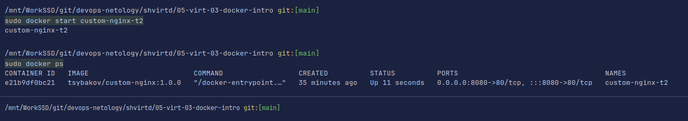

# Домашнее задание к занятию 4 «Оркестрация группой Docker контейнеров на примере Docker Compose»

### Инструкция к выполнению

1. Для выполнения заданий обязательно ознакомьтесь с 
[инструкцией](https://github.com/netology-code/devops-materials/blob/master/cloudwork.MD) 
по экономии облачных ресурсов. Это нужно, чтобы не расходовать средства, полученные в результате 
использования промокода.
2. Практические задачи выполняйте на личной рабочей станции или созданной вами ранее ВМ в облаке.
3. Своё решение к задачам оформите в вашем GitHub репозитории в формате markdown!!!
4. В личном кабинете отправьте на проверку ссылку на .md-файл в вашем репозитории.

## Задача 1
<details>
 <summary>Задача 1</summary>

Сценарий выполнения задачи:
   - Установите docker и docker compose plugin на свою linux рабочую станцию или ВМ;
   - Если dockerhub недоступен создайте файл /etc/docker/daemon.json с содержимым: 
  ```text
   {
   "registry-mirrors": ["https://mirror.gcr.io", 
                        "https://daocloud.io", 
                        "https://c.163.com/", 
                        "https://registry.docker-cn.com"]
   }
   ```
   - Зарегистрируйтесь и создайте публичный репозиторий  с именем "custom-nginx" на https://hub.docker.com (ТОЛЬКО ЕСЛИ У ВАС ЕСТЬ ДОСТУП);
   - скачайте образ nginx:1.21.1;
   - Создайте Dockerfile и реализуйте в нем замену дефолтной индекс-страницы(/usr/share/nginx/html/index.html), на файл index.html с содержимым:
```text
<html>
<head>
Hey, Netology
</head>
<body>
<h1>I will be DevOps Engineer!</h1>
</body>
</html>
```
- Соберите и отправьте созданный образ в свой dockerhub-репозитории c tag 1.0.0 (ТОЛЬКО ЕСЛИ ЕСТЬ ДОСТУП);
- Предоставьте ответ в виде ссылки на https://hub.docker.com/<username_repo>/custom-nginx/general.

</details>

1. Установил docker.
   ```shell
   docker --version
   ```  
   ```shell
   docker compose version
   ```
   Фото версий.\
   
2. Добавил файл и перезагрузил docker. 
   ```shell
   sudo systemctl stop docker
   ```
   ```shell
   sudo  systemctl start docker
   ```
   
3. Зарегистрировался на https://hub.docker.com/ .\
   
4. Загрузил образ nginx.
   ```shell
   sudo docker pull nginx:1.21.1
   ```
   
5. [Dockerfile](./files/Dockerfile).
6. Сбор образа. 
   ```shell
   sudo docker build -t tsybakov/custom-nginx:1.0.0 .
   ```
   
7. Зашёл на сайт.
   ```shell
   docker login  -u tsybakov
   ```
   Загрузил образ в репозиторий.
   ```shell
   docker push tsybakov/custom-nginx:1.0.0
   ```
   [Ссылка на docker hub](https://hub.docker.com/r/tsybakov/custom-nginx/tags "Tsybakov").

## Задача 2
<details>
 <summary>Задача 2</summary>

1. Запустите ваш образ custom-nginx:1.0.0 командой docker run в соответствии с требованиями:
   - имя контейнера "ФИО-custom-nginx-t2"
   - контейнер работает в фоне
   - контейнер опубликован на порту хост системы 127.0.0.1:8080
2. Переименуйте контейнер в "custom-nginx-t2"
3. Выполните команду ```date +"%d-%m-%Y %T.%N %Z" ; sleep 0.150 ; docker ps ; ss -tlpn | grep 127.0.0.1:8080  ; docker logs custom-nginx-t2 -n1 ; docker exec -it custom-nginx-t2 base64 /usr/share/nginx/html/index.html```
4. Убедитесь с помощью curl или веб браузера, что индекс-страница доступна.

В качестве ответа приложите скриншоты консоли, где видно все введенные команды и их вывод.

</details>

1. Запуск контейнера.
   ```shell
   sudo docker run --name TsybakovArtyomAleksandrovich-custom-nginx-t2 -p 8080:80 -d tsybakov/custom-nginx:1.0.0
   ```
   
2. Переименование контейнера.
   ```shell
   sudo docker rename TsybakovArtyomAleksandrovich-custom-nginx-t2 custom-nginx-t2
   ```
   
3. Выполнение команды.
   ```shell
   date +"%d-%m-%Y %T.%N %Z" ; sleep 0.150 ; docker ps ; ss -tlpn | grep 127.0.0.1:8080  ; docker logs custom-nginx-t2 -n1 ; docker exec -it custom-nginx-t2 base64 /usr/share/nginx/html/index.html
   ```
   

## Задача 3
<details>
 <summary>Текст задания 3</summary>

1. Воспользуйтесь docker help или google, чтобы узнать как подключиться к стандартному потоку ввода/вывода/ошибок контейнера "custom-nginx-t2".
2. Подключитесь к контейнеру и нажмите комбинацию Ctrl-C.
3. Выполните ```docker ps -a``` и объясните своими словами почему контейнер остановился.
4. Перезапустите контейнер
5. Зайдите в интерактивный терминал контейнера "custom-nginx-t2" с оболочкой bash.
6. Установите любимый текстовый редактор(vim, nano итд) с помощью apt-get.
7. Отредактируйте файл "/etc/nginx/conf.d/default.conf", заменив порт "listen 80" на "listen 81".
8. Запомните(!) и выполните команду ```nginx -s reload```, а затем внутри контейнера ```curl http://127.0.0.1:80 ; curl http://127.0.0.1:81```.
9. Выйдите из контейнера, набрав в консоли  ```exit``` или Ctrl-D.
10. Проверьте вывод команд: ```ss -tlpn | grep 127.0.0.1:8080``` , ```docker port custom-nginx-t2```, ```curl http://127.0.0.1:8080```. 
Кратко объясните суть возникшей проблемы.
11. * Это дополнительное, необязательное задание. Попробуйте самостоятельно исправить конфигурацию контейнера,
используя доступные источники в интернете. Не изменяйте конфигурацию nginx и не удаляйте контейнер. 
Останавливать контейнер можно. [пример источника](https://www.baeldung.com/linux/assign-port-docker-container)
12. Удалите запущенный контейнер "custom-nginx-t2", не останавливая его.(воспользуйтесь --help или google)

В качестве ответа приложите скриншоты консоли, где видно все введенные команды и их вывод.

</details>

1. Подключение к контейнеру. 
   ```shell
   sudo docker attach custom-nginx-t2 
   ```
   Нажал комбинацию Ctrl+C.   
2. Контейнер закрылся, потому что мы прекратили выполнение процесса который был внутри контейнера.
   
3. Перезапуск контейнера.
   ```shell
   sudo docker start custom-nginx-t2
   ```
   
4. Подключение к интерактивному терминалу с оболочкой bash.
   ```shell
   sudo docker exec -it custom-nginx-t2 bash
   ```
5. Установил программу для редактирования внутрь контейнера. Изменил порт внутри конфигурационного файла.
   ```shell
   apt-get update
   ```
   ```shell
   apt-get install vim
   ```
6. Выполнил команды внутри контейнера.\
   
7. Отключился. Выполнил команды. После изменения порта в конфигурационном файле, сервер стал недоступен.
8. Остановил контейнер. Остановил docker. Исправил конфигурационные файлы контейнера. Запустил все в обратном порядке. 
   Страница снова стала доступной.
   ```shell
   sudo docker inspect --format="{{.Id}}" custom-nginx-t2
   ```
   ```shell
   sudo docker stop  custom-nginx-t2
   ```
   ```shell
   sudo  systemctl stop docker
   ```
   ```shell
   sudo ls /var/lib/docker/containers/e21b9df0bc21f4b5df49ffb8e2a7b32a2727c8a41c4ebb6249af47dea96d7fe8
   ```
   ```shell
   sudo pycharm-community /var/lib/docker/containers/e21b9df0bc21f4b5df49ffb8e2a7b32a2727c8a41c4ebb6249af47dea96d7fe8/hostconfig.json
   ```
   ```shell
   sudo pycharm-community /var/lib/docker/containers/e21b9df0bc21f4b5df49ffb8e2a7b32a2727c8a41c4ebb6249af47dea96d7fe8/config.v2.json
   ```
   ```shell
   sudo  systemctl start docker
   ```
   
   
9. Удалил контейнер с ключом `-f`
   ```shell
   sudo docker rm -f custom-nginx-t2
   ```

## Задача 4
<details>
 <summary>Текст задания 4</summary>

- Запустите первый контейнер из образа ***centos*** c любым тегом в фоновом режиме, подключив папку  текущий рабочий каталог ```$(pwd)``` на хостовой машине в ```/data``` контейнера, используя ключ -v.
- Запустите второй контейнер из образа ***debian*** в фоновом режиме, подключив текущий рабочий каталог ```$(pwd)``` в ```/data``` контейнера. 
- Подключитесь к первому контейнеру с помощью ```docker exec``` и создайте текстовый файл любого содержания в ```/data```.
- Добавьте ещё один файл в текущий каталог ```$(pwd)``` на хостовой машине.
- Подключитесь во второй контейнер и отобразите листинг и содержание файлов в ```/data``` контейнера.

В качестве ответа приложите скриншоты консоли, где видно все введенные команды и их вывод.

</details>

1. Загрузил образы.
   ```shell
   sudo docker pull centos
   ```
   ```shell
   sudo docker pull debian
   ```
2. Запустил оба образа. 
   ```shell
   sudo docker run -i -t -v $(pwd):/data -w /data centos
   ```
   ```shell
   sudo docker run -i -t -v $(pwd):/data -w /data debian
   ```
3. Добавил файл через первый контейнер.\
   \
   Добавил файл через второй контейнер.\
   \
   Проверка.\
   \

## Задача 5
<details>
 <summary>Текст задания 5</summary>

1. Создайте отдельную директорию(например /tmp/netology/docker/task5) и 2 файла внутри него.
"compose.yaml" с содержимым:
```
version: "3"
services:
  portainer:
    image: portainer/portainer-ce:latest
    network_mode: host
    ports:
      - "9000:9000"
    volumes:
      - /var/run/docker.sock:/var/run/docker.sock
```
"docker-compose.yaml" с содержимым:
```
version: "3"
services:
  registry:
    image: registry:2
    network_mode: host
    ports:
    - "5000:5000"
```

И выполните команду "docker compose up -d". Какой из файлов был запущен и почему? (подсказка: https://docs.docker.com/compose/compose-application-model/#the-compose-file )

2. Отредактируйте файл compose.yaml так, чтобы были запущенны оба файла. (подсказка: https://docs.docker.com/compose/compose-file/14-include/)

3. Выполните в консоли вашей хостовой ОС необходимые команды чтобы залить образ custom-nginx как custom-nginx:latest в запущенное вами, локальное registry. Дополнительная документация: https://distribution.github.io/distribution/about/deploying/
4. Откройте страницу "https://127.0.0.1:9000" и произведите начальную настройку portainer.(логин и пароль администратора)
5. Откройте страницу "http://127.0.0.1:9000/#!/home", выберите ваше local  окружение. Перейдите на вкладку "stacks" и в "web editor" задеплойте следующий компоуз:

```
version: '3'

services:
  nginx:
    image: 127.0.0.1:5000/custom-nginx
    ports:
      - "9090:80"
```
6. Перейдите на страницу "http://127.0.0.1:9000/#!/2/docker/containers", выберите контейнер с nginx и нажмите 
на кнопку "inspect". В представлении <> Tree разверните поле "Config" и сделайте скриншот от поля "AppArmorProfile" до "Driver".

7. Удалите любой из манифестов компоуза(например compose.yaml).  Выполните команду "docker compose up -d". 
Прочитайте warning, объясните суть предупреждения и выполните предложенное действие. Погасите compose-проект ОДНОЙ(обязательно!!) командой.

В качестве ответа приложите скриншоты консоли, где видно все введенные команды и их вывод, файл compose.yaml , скриншот portainer c задеплоенным компоузом.
---

</details>

1. Создал 2 файла в каталоге task5.\
   
2. Выполнил команду. Запустился только файл compose.yaml . По умолчанию Compose ищет файл compose.yaml в этой
же директории. Для обратной совместимости добавлена поддержка docker-compose.yaml файла. Если существуют оба файла, 
то Compose отдает предпочтение файлу compose.yaml и запускает его.
3. Что бы запустить оба файла, нужно объявить второй файл в зависимостях в первом файле. Объявить нужно в секции 
include, которая находится в самом верху файла.
   ```text
   version: "3"
   include:
    - docker-compose.yaml
   services:
   portainer:
    image: portainer/portainer-ce:latest
    network_mode: host
    ports:
      - "9000:9000"
    volumes:
      - /var/run/docker.sock:/var/run/docker.sock
   ```
   После внесения изменений запустились оба контейнера.\
   
4. Зашел в Portainer.\
   
   
5. Удалил compose.yaml
   Запустил ещё раз команду
   ```shell
   sudo docker compose up -d
   ```
   Docker Compose пишет предупреждение. Версия docker-compose.yaml устарела и найден бесхозный контейнер. 
Что бы удалить это бесхозный контейнер, нужно запустить еще раз команду `sudo docker compose up -d` с 
флагом `--remove-orphans`.
   
   