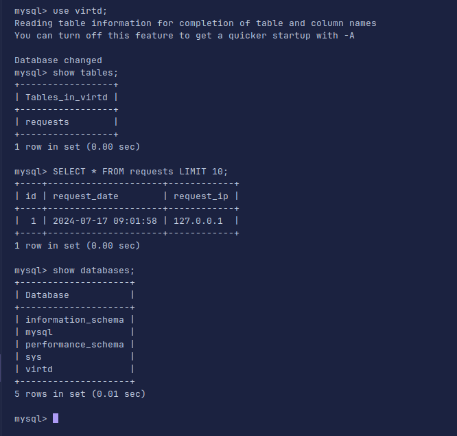
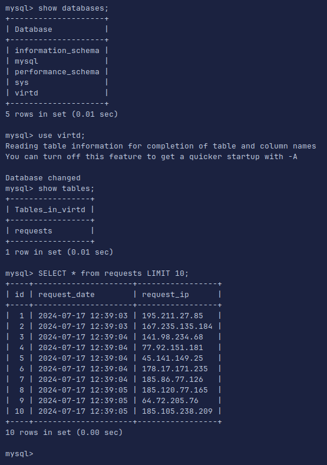
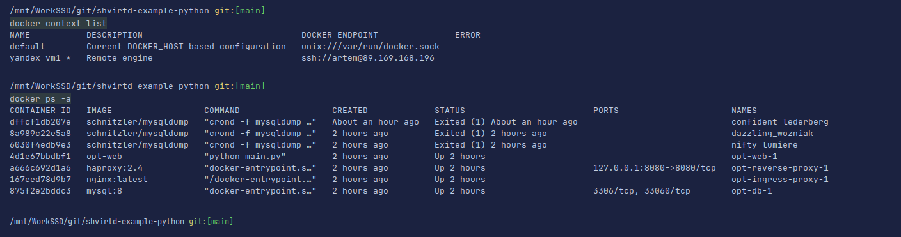
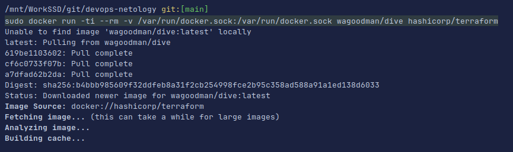
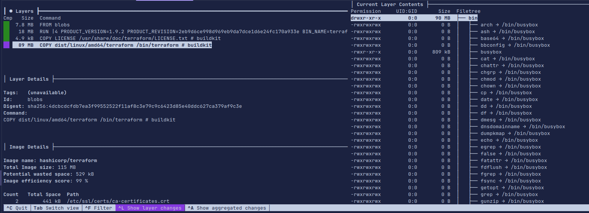
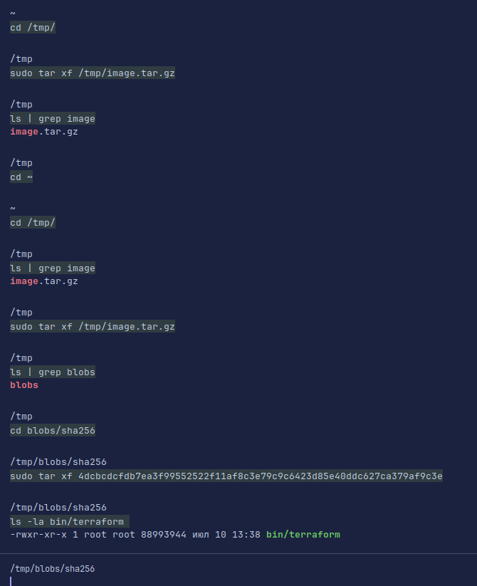
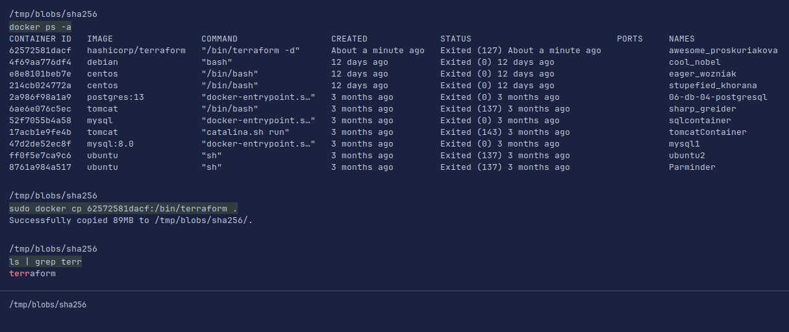

# Домашнее задание к занятию 5. «Практическое применение Docker»

### Инструкция к выполнению

1. Для выполнения заданий обязательно ознакомьтесь с [инструкцией](https://github.com/netology-code/devops-materials/blob/master/cloudwork.MD) по экономии облачных ресурсов. Это нужно, чтобы не расходовать средства, полученные в результате использования промокода.
2. **Своё решение к задачам оформите в вашем GitHub репозитории.**
3. В личном кабинете отправьте на проверку ссылку на .md-файл в вашем репозитории.
4. Сопроводите ответ необходимыми скриншотами.

---
## Примечание: Ознакомьтесь со схемой виртуального стенда [по ссылке](https://github.com/netology-code/shvirtd-example-python/blob/main/schema.pdf)

## Задача 0
У меня не установлен старый `docker-compose`.
```text
/mnt/WorkSSD/git/devops-netology/shvirtd/05-virt-03-docker-intro git:[main]
docker-compose --version
Команда «docker-compose» не найдена, но может быть установлена с помощью:
sudo snap install docker          # version 24.0.5, or
sudo apt  install docker-compose  # version 1.29.2-1
См. 'snap info docker', чтобы посмотреть дополнительные версии.
```
## Задача 1
```text
git clone https://github.com/artemtsybakov/shvirtd-example-python.git
Клонирование в «shvirtd-example-python»...
remote: Enumerating objects: 53, done.
remote: Counting objects: 100% (25/25), done.
remote: Compressing objects: 100% (15/15), done.
remote: Total 53 (delta 15), reused 11 (delta 8), pack-reused 28
Получение объектов: 100% (53/53), 44.64 КиБ | 457.00 КиБ/с, готово.
Определение изменений: 100% (16/16), готово.
```

## Задача 2
[Отчет о скнировании](vulnerabilities.csv)

## Задача 3


## Задача 4

[bash скрипт](https://github.com/artemtsybakov/shvirtd-example-python/blob/main/bash.sh) \
[Fork репозиторий](https://github.com/artemtsybakov/shvirtd-example-python/tree/main) \
 \
```shell
sudo docker context create \
    --docker host=ssh:artem@89.169.168.196 \
    --description="Remote engine" \
    yandex_vm1
```


## Задача 5
Пока не получается сделать. 
Добавил сеть в которой запущен проект с БД. Спрятал пароли в файле env.list . Запускаю.
```text
sudo docker run -it \
    --network=opt_backend \
    --env-file /opt/env.list \
    -v `pwd`/backup:/backup \
    --link="opt-db-1:alias" \
    schnitzler/mysqldump \
    mysqldump --opt -h alias -u ${MYSQL_USER} -p${MYSQL_PASSWORD} "--result-file=/backup/dumps.sql" ${MYSQL_DATABASE}
```
Получаю ошибку.
```text
crond: unrecognized option: opt
BusyBox v1.36.1 (2023-06-02 00:42:02 UTC) multi-call binary.

Usage: crond [-fbS] [-l N] [-d N] [-L LOGFILE] [-c DIR]

        -f      Foreground
        -b      Background (default)
        -S      Log to syslog (default)
        -l N    Set log level. Most verbose 0, default 8
        -d N    Set log level, log to stderr
        -L FILE Log to FILE
        -c DIR  Cron dir. Default:/var/spool/cron/crontabs
```
Если запускаю без файлика и с пустыми переменными окружения, то получаю ошибку подключения.
```text
sudo docker run \
    --network=opt_backend \
    --rm --entrypoint "" \
    -v `pwd`/backup:/backup \
    --link="opt-db-1:alias" \
    schnitzler/mysqldump \
    mysqldump --opt -h alias -u"root" -p"YtReWq4321" "--result-file=/backup/dumps.sql" virtd
```
```text
mysqldump: Got error: 1045: "Plugin caching_sha2_password could not be loaded: Error loading shared library /usr/lib/mariadb/plugin/caching_sha2_password.so: No such file or directory" when trying to connect
```
## Задача 6.1
```shell
sudo docker pull hashicorp/terraform:latest
```

```shell
sudo docker run -ti --rm -v /var/run/docker.sock:/var/run/docker.sock wagoodman/dive hashicorp/terraform
```


```shell
sudo docker image  save -o  /tmp/image.tar.gz hashicorp/terraform
```

```shell
cd /tmp/
```
```shell
sudo tar xf /tmp/image.tar.gz
```
```shell
cd blobs/sha256
```
```shell
sudo tar xf 4dcbcdcfdb7ea3f99552522f11af8c3e79c9c6423d85e40ddc627ca379af9c3e
```
```shell
ls -la bin/terraform
```
 

## Задача 6.1
Создадим контейнер.
```shell
docker run hashicorp/terraform -d
```
Подключимся и скачаем файл.
```shell
sudo docker cp 461faec92273:/bin/terraform .
```
