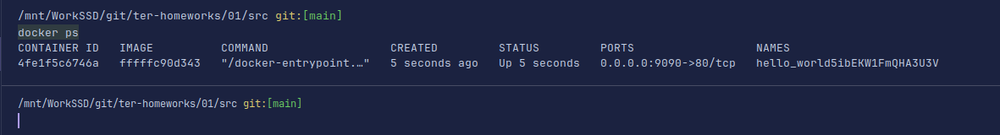

# Домашнее задание к занятию «Введение в Terraform»

### Цели задания

1. Установить и настроить Terrafrom.
2. Научиться использовать готовый код.

------

### Чек-лист готовности к домашнему заданию

1. Скачайте и установите **Terraform** версии ~>1.8.4. Приложите скриншот вывода команды ```terraform --version```.
2. Скачайте на свой ПК этот git-репозиторий. Исходный код для выполнения задания расположен в директории **01/src**.
3. Убедитесь, что в вашей ОС установлен docker.


------

### Задание 1
1. Скачивание зависимостей.
   ```shell
   terraform init
   ```
   

2. Личную, секретную информацию допустимо хранить в файле `personal.auto.tfvars`.
3. `"result": "5ibEKW1FmQHA3U3V"`.
4. Ошибки. Пропущено имя ресурса в строке 24. Нужно добавить имя ресурса после типа. Неправильное имя ресурса в строке 29.
Имя ресурса не может начинаться с цифры. Может начинаться с буквы или символа подчеркивания. Нужно убрать цифру.

   

   После повторной проверки появились ещё две ошибки. Нужно исправить имена ресурсов.
   

5. Фрагмент файла.
   ```docker
      resource "docker_image" "nginx" {
          name         = "nginx:latest"
          keep_locally = true
      }

      resource "docker_container" "nginx" {
           image = docker_image.nginx.image_id
           name  = "example_${random_password.random_string.result}"

           ports {
              internal = 80
              external = 9090 
           }
  
   ```
   

6. Когда выполняется команда с этим ключом, то пропускается интерактивное подтверждение (ввод команды yes). Эта опция 
может быть полезна когда задача автоматизируется.

   

7. Содержимое файла.

   ```terraform
   {
        "version": 4,
        "terraform_version": "1.8.4",
        "serial": 11,
        "lineage": "03868706-014b-c7b7-1106-97b688decaff",
        "outputs": {},
        "resources": [],
        "check_results": null
   }
   ```

8. В схеме ресурса установленна необязательная опция `keep_locally`. Неудалять образ при уничтожении всех ресурсов.

   ```text
   keep_locally (Boolean) If true, then the Docker image won't be deleted on destroy operation. 
   If this is false, it will delete the image from the docker local storage on destroy operation.
   ```
   
### Задание 2


[Ссылка на код](./src/main.tf) 

### Задание 3


Выдает ошибку.


Исправляю версию. Запустилось. Результат такой же.


