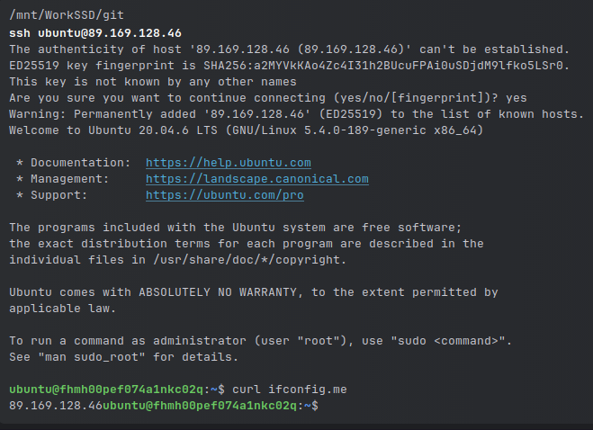
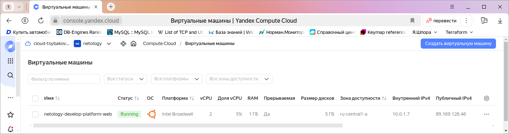
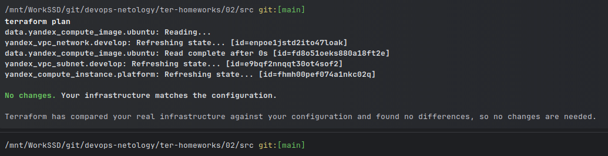
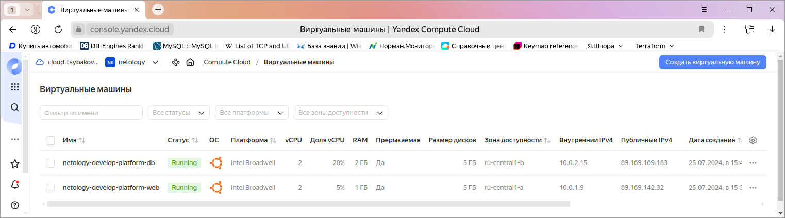
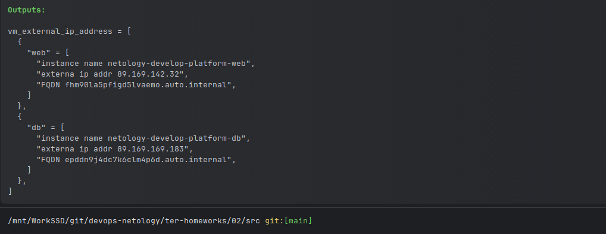

# Домашнее задание к занятию «Основы Terraform. Yandex Cloud»

### Цели задания

1. Создать свои ресурсы в облаке Yandex Cloud с помощью Terraform.
2. Освоить работу с переменными Terraform.

### Задание 1

Инициализировал проект. Инициализация прошла успешно.
```shell
terraform init
```
Ошибки.

Неправильно указан идентификатор процессора. Такого идентификатора не существует. Всего в YC три типа стандартной платформы.
Исправил грамматическую ошибку, указал правильную версию, изменил количество ядер. 
Параметры `preemptible = true` и `core_fraction=5` помогут сэкономить денег на оплате виртуальных машин. 





### Задание 2



### Задание 3



### Задание 4



