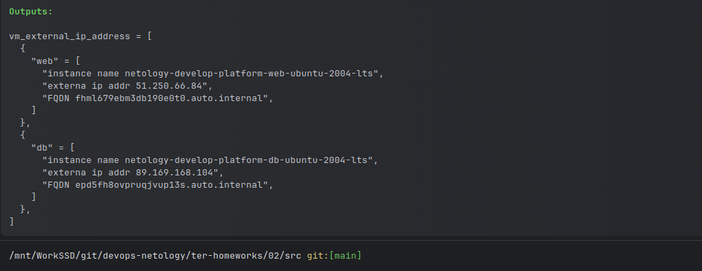

# Домашнее задание к занятию «Основы Terraform. Yandex Cloud»

### Цели задания

1. Создать свои ресурсы в облаке Yandex Cloud с помощью Terraform.
2. Освоить работу с переменными Terraform.

### Задание 1

Инициализировал проект. Инициализация прошла успешно.
```shell
terraform init
```
Ошибки.

Неправильно указан идентификатор процессора. Такого идентификатора не существует. Всего в YC три типа стандартной платформы.
Исправил грамматическую ошибку, указал правильную версию, изменил количество ядер. 
Параметры `preemptible = true` и `core_fraction=5` помогут сэкономить денег на оплате виртуальных машин. 


### Задание 2


### Задание 3


### Задание 4


### Задание 5

В "Outputs" видны новые имена ВМ.



### Задание 6
По заданию нужно сделать отдельную map переменную `vm_resources` для двух ВМ и `metadata` в виде map(object). Загрузить
данные в эти переменные из файла terraform.tfvars. Первая переменная у меня получилась, а вто вторая нет. Вторую 
map(object) заменил просто на object. 
Код terraform.tfvars.
```text
vm_resources = {
  web = {
    cores         = 2
    memory        = 1
    core_fraction = 5
  },
  db= {
    cores         = 2
    memory        = 2
    core_fraction = 20
  }
}

metadata = {
  serial-port-enable = 1
  ssh-keys           = "ubuntu:ssh-ed25519 ********************************************************** artem"
}
```
Текст переменных.
```text
variable "vm_resources" {
  type = map(object({
    cores         = number
    memory        = number
    core_fraction = number
    })
  )
  default = {}
}
variable "metadata" {
  type = object({
    serial-port-enable = number
    ssh-keys           = string
    })
}
```
В main.tf
```text
  resources {
    cores         = var.vm_resources["db"]["cores"]
    memory        = var.vm_resources["db"]["memory"]
    core_fraction = var.vm_resources["db"]["core_fraction"]
  }
```
В vms-platform.tf
```text
  resources {
    cores         = var.vm_resources["web"]["cores"]
    memory        = var.vm_resources["web"]["memory"]
    core_fraction = var.vm_resources["web"]["core_fraction"]
  }
```

### Задание 7

1. ```text
   > local.test_list[1]
   "staging"
   >  
   ```
2. ```text
   > length(local.test_list)
   3
   >
   ```
3. ```text
   > local.test_map.admin
   "John"
   > 
   ```
4. ```text 
   "${local.test_map.admin} is ${keys(local.test_map)[0]} for ${local.test_list[2]} server based on OS ${local.servers.production.image} with ${local.servers.production.cpu} vcpu, ${local.servers.production.ram} ram and ${length(local.servers.production.disks)} virtual disks"
   ```
   "John is admin for production server based on OS ubuntu-20-04 with X vcpu, Y ram and Z virtual disks"

### Задание 8
Переменная
```text
variable "test" {
  type = tuple([map(list(string)),map(list(string)),map(list(string))])
}
```
```text
> var.test[0]["dev1"][0]
"ssh -o 'StrictHostKeyChecking=no' ubuntu@62.84.124.117"
>  
```