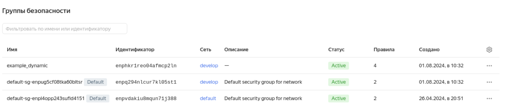
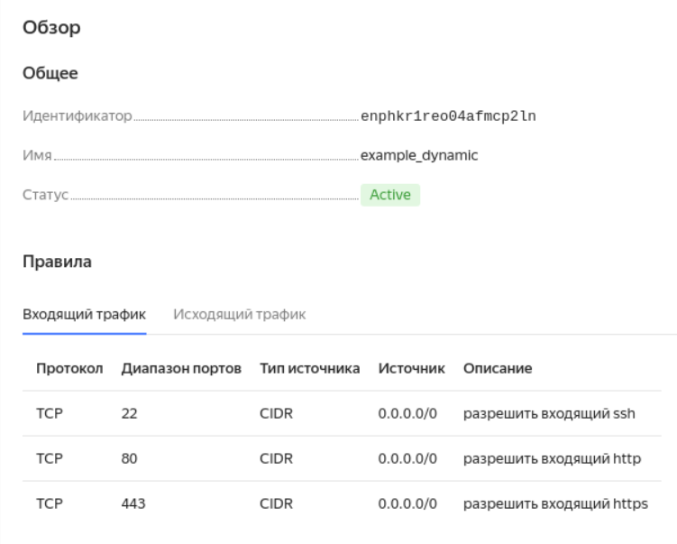
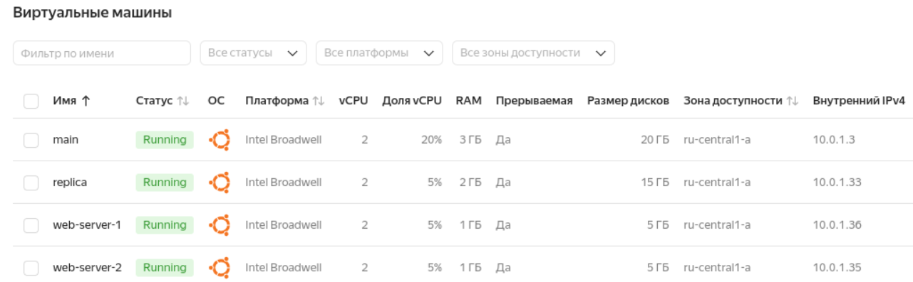
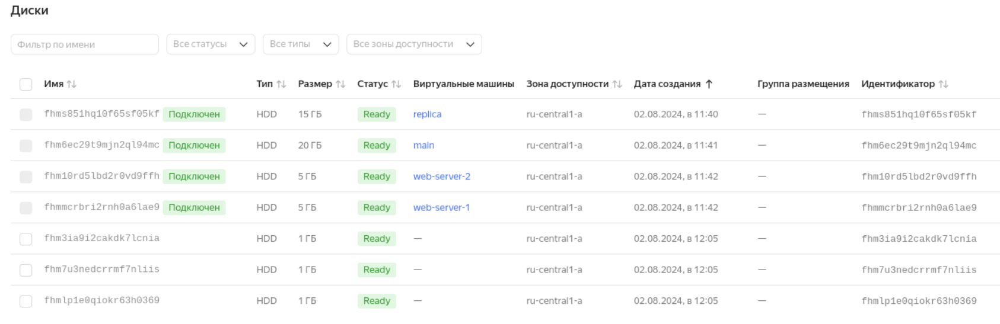
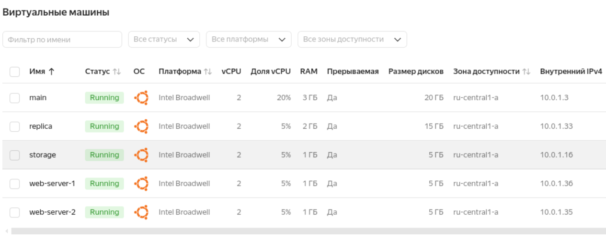
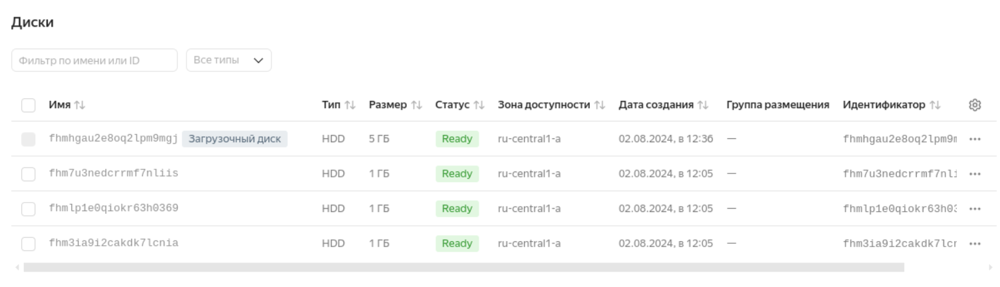
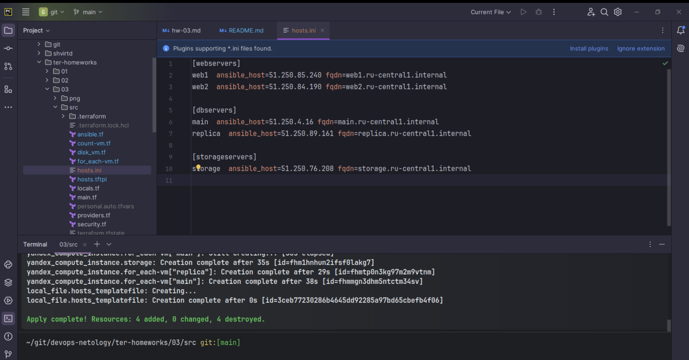
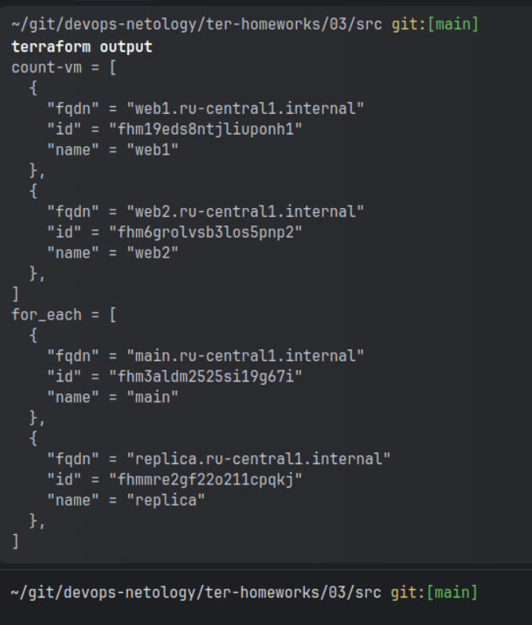

# Домашнее задание к занятию «Управляющие конструкции в коде Terraform»

### Задание 1
Были созданы 3 ресурса. 
- Сеть develop.
- Подсеть develop.
- Группа безопасности example для сети develop. Так же была создана группа безопасности по умолчанию для сети develop.

### Задание 2

Созданы четыре ВМ. Две ВМ методом count с одинаковыми характеристиками и разными названиями.
Две ВМ методом for_each с разными характеристиками.

### Задание 3

Создал 3 диска.

Создал ВМ storage

Добавил локальную переменную, в которой собрал идентификаторы диска. На ресурсе преобразовал эту переменную 
в set. Добавил идентификаторы дисков в динамическом блоке.

### Задание 4

### Задание 5

Добавил output для ВМ созданных через count и for each.

