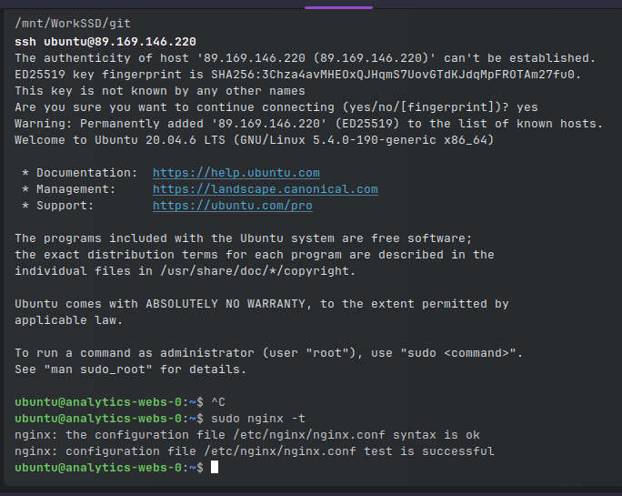
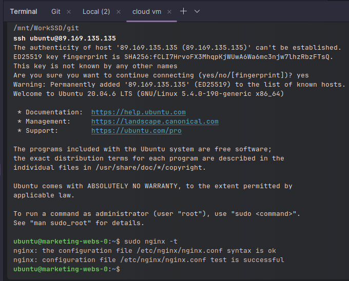

# Домашнее задание к занятию «Продвинутые методы работы с Terraform»

### Задание 1
Cкриншот подключения к консоли и вывод команды ```sudo nginx -t```.





Cкриншот консоли ВМ yandex cloud с их метками.


Cкриншот содержимого модуля.


### Задание 2

Добавил новы модуль. Модуль находится в папке module/vpc . Инициализация прошла успешно.


После выполнения `terraform plan` получил вот такой [результат](./src/terraform_plan). Будет удалена 1 сеть, 2 подсети и 
изменены 2 ВМ.
После выполнения `terraform applay` получил ошибку `Quota limit vpc.networks.count exceeded` (Превышен лимит количества 
vpc). Удалил весь проект и снова создал. Все получилось.

Cкриншот информации из terraform console о своем модуле.


Сгенерируйте документацию к модулю с помощью [terraform-docs](./src/module/vpc/README.md).

### Задание 3

1. Список ресурсов в стейте.

    

2. Полностью удалите из стейта модуль vpc_dev.

   Import ресурсов происходит с указанием id ресурса. Сохранил id.
   
   
   
   Удалил модуль.

   

3. Удалил модуль vm.

   

4. Импортируйте всё обратно. Проверьте terraform plan. Значимых(!!) изменений быть не должно. 

   После удаления state выглядит вот так.

   

   Добавляю назад vpc.

   

   Добавляю назад vm. id ресурса взял из облака.

   
   
   

   Проверка после импорта.
   
   

### Задание 4

Код
```terraform
#создаем сеть
resource "yandex_vpc_network" "develop" {
  name = var.env_name
}

#создаем подсеть
resource "yandex_vpc_subnet" "develop" {
   #Преобразовываем list(object) в map(object) с которым работает for_each.
   #каждую подсеть мы идентифицируем уникальным ключом именем зоны.
  for_each = {for zone in var.subnets : zone.zone => zone }
  name           = "${var.env_name}-${each.key}"
  zone           = each.key
  network_id     = yandex_vpc_network.develop.id
  v4_cidr_blocks = [each.value.cidr]
}
```


[terraform plan](./src/plan.md)

Скриншот из консоли.


Скриншот из YC.


